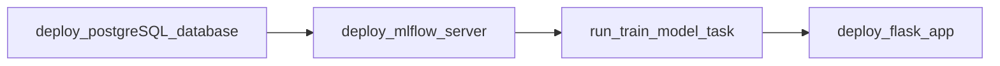
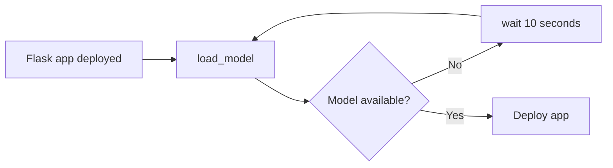

# System Architecture

## Overview

Above is a diagram of the deployment architecture. The deployment consists of 3 key services, each deployed to their own container within the Docker network.
1. The Mlflow server, which is responsible for housing the trained models so that they are accessible by the wider app.
2. The PSQL deployment, which provides artifact storage for Mlflow. An external database for storage is a requirement for Mlflow.
3. The Flask app, which is the primary service the user will interact with. It contains the `bechdel-test-predictor` code as a backend, and a basic html web page for the frontend interface.

## Process flow
The basic process flow for the deployment is as follows:

1. The psql database is deployed.
2. The mlflow server is deployed, using the psql database for it's artifact storage.
2. The `train_model.py` script is ran as a single task. This trains the model and logs it to the mlflow server.
3. The flask service is started, which first loads the trained model from Mlflow, and then deploys the flask app.
4. The user can now interact with the flask app via the web interface, and generate bechdel test predictions for their chosen movie titles!

## Flask App Quirks
One quirk of the docker-compose deployment is that, although we can set the `depends-on` settings, that _does not_ wait for the task/container to be finished, it simply waits for it to be triggered. This leads to a problem, what happens if the flask app is deployed _before_ the model training and logging is complete? To avoid this problem, the flask app uses the `backoff` python package when loading the model.

## Inference Process Flow

1. The user inputs a film via the flask app
2. The MovieClient makes a request to the TMDB API to retrieve the movie data
3. The MovieProcessor converts the raw movie data into model features
4. The Model generates a prediction of the movies probability to pass the Bechdel test
5. The Prediction formats the raw probability to a human readable output
6. The formated prediction is displayed to the user in the flask app