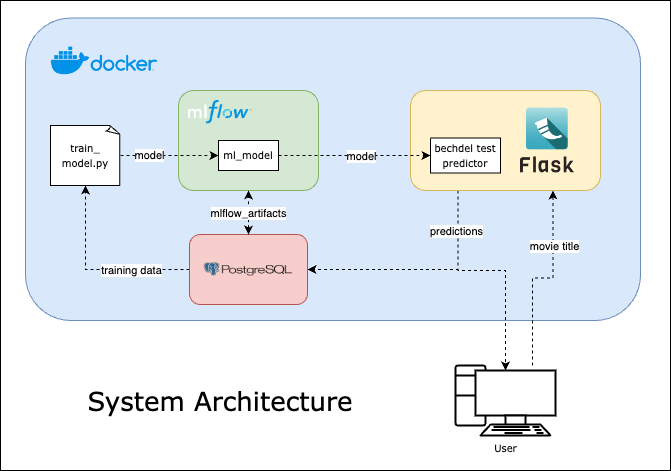
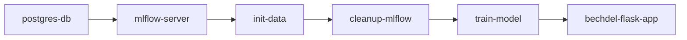
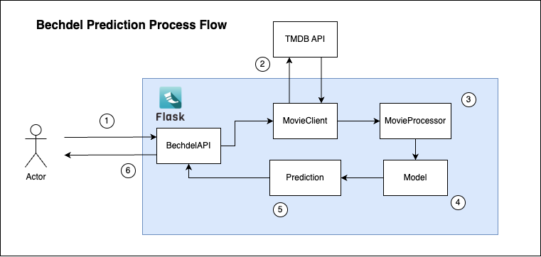

# System Architecture

## Overview

Above is a diagram of the deployment architecture. The deployment consists of 3 key services, each deployed to their own container within the Docker network.
1. The Mlflow server, which is responsible for housing the trained models so that they are accessible by the wider app.
2. The PSQL deployment, which provides a SQL database for storing the training data and the models prediction logs. It also provides artifact storage for Mlflow. An external database for storage is a requirement for Mlflow.
3. The Flask app, which is the primary service the user will interact with. It contains the `bechdel-test-predictor` code as a backend, and a basic html web page for the frontend interface.

## Process flow
The basic process flow for the deployment is as follows:

1. The psql database is deployed.
2. The mlflow server is deployed, using the psql database for it's artifact storage. You can browse the mlflow server with the mlflow ui by going to `http://localhost:5001`.
3. The `services/python_tasks/init_data.py` script is ran as a single task. This script contains a Metaflow flow, which downloads the training data using [opendatasets](https://github.com/JovianHQ/opendatasets/tree/master) and ingests it into the PSQL database as the `movies` table.
4. The `services/python_tasks/cleanup_mlflow.py` script is ran as a single task. This script contains a Metaflow flow which deletes the models and the experiments from mlflow, and then runs the mlflow garbage collection call. This ensures all mlflow metadata is also cleared.
5. The `services/python_tasks/train_model.py` script is ran as a single task. This script contains a Metaflow flow which loads the data from the `movies` table in the database, trains the model, and logs it to the mlflow model registry. This task is logged as an mlflow experiment, and some params, metrics, and artifacts are logged.
6. The flask app is deployed, which loads the trained model from the mlflow model registry, and provides a front end service that the user can interact with. You can interactve with the app by going to `http://localhost:5000`.

## Inference Process Flow

1. The user inputs a film via the flask app
2. The MovieClient makes a request to the TMDB API to retrieve the movie data
3. The MovieProcessor converts the raw movie data into model features
4. The Model generates a prediction of the movies probability to pass the Bechdel test
5. The Prediction formats the raw probability to a human readable output
6. The formated prediction is displayed to the user in the flask app