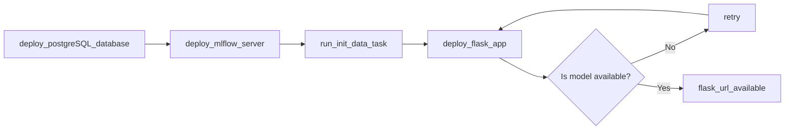

# System Architecture

## Overview

Above is a diagram of the deployment architecture. The deployment consists of 3 key services, each deployed to their own container within the Docker network.
1. The Mlflow server, which is responsible for housing the trained models so that they are accessible by the wider app.
2. The PSQL deployment, which provides a SQL database for storing the training data and the models prediction logs. It also provides artifact storage for Mlflow. An external database for storage is a requirement for Mlflow.
3. The Flask app, which is the primary service the user will interact with. It contains the `bechdel-test-predictor` code as a backend, and a basic html web page for the frontend interface.

## Process flow
The basic process flow for the deployment is as follows:

1. The psql database is deployed.
2. The mlflow server is deployed, using the psql database for it's artifact storage.
2. The `init_data.py` script is ran as a single task. This downloads the training data using [opendatasets](https://github.com/JovianHQ/opendatasets/tree/master) and ingests it into the PSQL database as the `movies` table.
3. The flask service is deployed, which first attempts to load a model from the mlflow model registry. If no model is found, it waits 10 seconds and retries. This retry loop happens indefinitely. If a model is found, it loads the model into memory and deploys the flask app.
4. The user can now interact with the flask app via the web interface, and generate bechdel test predictions for their chosen movie titles!

## Inference Process Flow

1. The user inputs a film via the flask app
2. The MovieClient makes a request to the TMDB API to retrieve the movie data
3. The MovieProcessor converts the raw movie data into model features
4. The Model generates a prediction of the movies probability to pass the Bechdel test
5. The Prediction formats the raw probability to a human readable output
6. The formated prediction is displayed to the user in the flask app